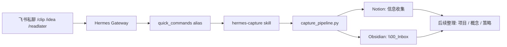

# System Map

## v1 信息流

## 边界

- Notion 是收集库，保留原始 URL、正文快照、状态和项目归属。
- Obsidian 是知识库，先进入 `00_Inbox`，之后人工或半自动提炼。
- GitHub 只管系统源码，不保存原始资料和密钥。

## 本阶段不做

- 不迁移整个 `<OBSIDIAN_VAULT>` vault。
- 不自动保存所有飞书消息。
- 不做交易系统、KOL 指数、宝妈指数的数据生产线。
- 不把 Notion 历史信息一次性重构。
